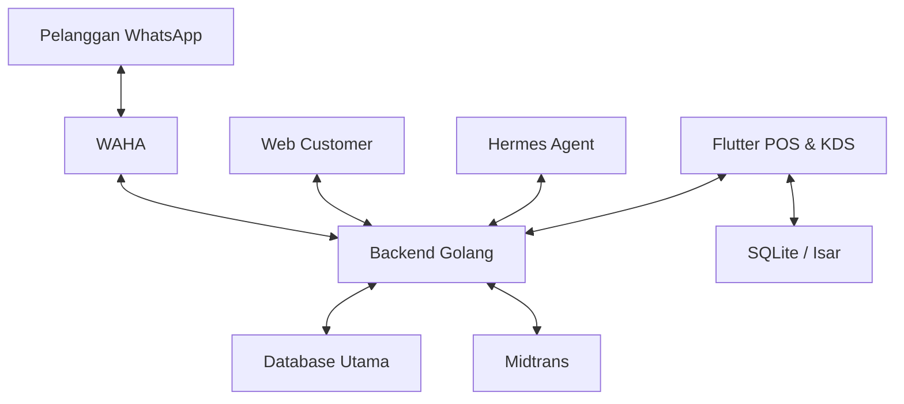
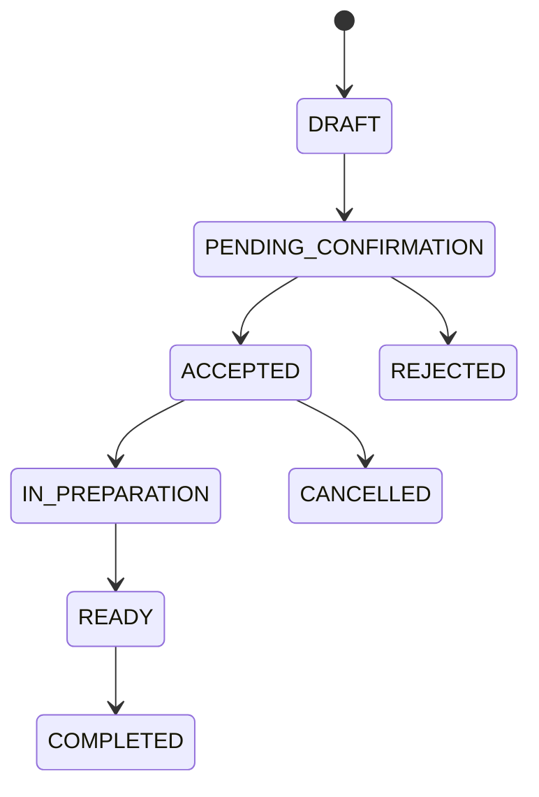

# Product Requirement Document (PRD)

## PesenHub — Outlet Order Management System (OMS)

| Field | Value |
| --- | --- |
| Product | PesenHub |
| Version | 1.0 |
| Status | Draft for Implementation |
| MVP target | 1 month |
| Full scope target | 4–5 months |
| Author | Product Team / Lead Engineer |
| Last updated | 1 September 2026 |

## 1. Ringkasan Produk

PesenHub adalah sistem pemesanan terpusat untuk menggantikan pencatatan manual berbasis buku pada outlet nasi goreng. Sistem menyatukan pesanan dari kasir, WhatsApp, dan Web Customer ke dalam satu antrean, membantu kasir yang juga menangani produksi, menerima pembayaran digital melalui Midtrans, dan memberi informasi otomatis kepada pelanggan ketika pesanan sudah selesai.

Komponen utama sistem:

- Aplikasi mobile Flutter sebagai POS, antrean pesanan, dan Kitchen Display System (KDS).
- Backend Golang sebagai sumber data utama dan pengendali seluruh proses bisnis.
- Web Customer sederhana yang disajikan melalui backend agar pelanggan dapat membuat pesanan tanpa menginstal aplikasi.
- WAHA sebagai gateway WhatsApp self-hosted.
- Hermes sebagai AI agent untuk memahami chat, mengumpulkan detail pesanan, meminta klarifikasi, dan mengirim pembaruan kepada pelanggan.
- Midtrans sebagai payment gateway untuk pembayaran digital.
- SQLite atau Isar sebagai penyimpanan lokal dan antrean sinkronisasi saat perangkat offline.

Dalam dokumen ini, pengguna yang memesan disebut **pelanggan**.

## 2. Tujuan dan Indikator Keberhasilan

### 2.1 Tujuan

1. Menyatukan pesanan Web Customer, WhatsApp, dan kasir ke satu antrean operasional.
2. Mengurangi order yang terlewat, tercatat ganda, atau tidak lengkap.
3. Mempercepat konfirmasi pesanan dan pembayaran.
4. Memastikan kasir tetap mengetahui pesanan baru ketika sedang memasak.
5. Memberi pelanggan pembaruan status secara otomatis melalui WhatsApp.
6. Menjaga operasi dasar tetap berjalan ketika internet terputus.

### 2.2 Target MVP

- Seluruh pesanan Web Customer, kasir, dan WhatsApp memiliki `order_id`, `source`, dan status yang jelas.
- Pesanan baru tampil di perangkat maksimal 5 detik setelah diterima dalam kondisi jaringan normal.
- Tidak ada pesanan terduplikasi akibat webhook atau sinkronisasi ulang.
- Kasir dapat menerima, menolak, memproses, dan menyelesaikan pesanan dari aplikasi.
- Pelanggan menerima konfirmasi saat pesanan diterima dan pemberitahuan saat pesanan selesai.
- Status pembayaran Midtrans hanya berubah berdasarkan webhook Midtrans yang tervalidasi.
- Pesanan kasir tetap dapat dibuat saat offline dan tersinkron ketika jaringan kembali tersedia.

## 3. Ruang Lingkup

### 3.1 Termasuk dalam MVP

- Login staf sederhana dan pembagian peran dasar.
- Pengelolaan menu, varian, topping, harga, dan ketersediaan.
- Web Customer tanpa akun: pelanggan cukup memasukkan nama dan nomor HP, memilih menu, mengonfirmasi pesanan, lalu memilih pembayaran.
- Identifikasi pelanggan berdasarkan nomor WhatsApp yang dinormalisasi.
- Penerimaan dan penyimpanan chat WhatsApp yang relevan dengan order.
- Pembuatan order manual melalui aplikasi.
- Pembuatan draft order dari percakapan oleh Hermes.
- Klarifikasi menu, jumlah, level pedas, topping, catatan, metode pemenuhan, dan metode pembayaran.
- Persetujuan pelanggan sebelum draft menjadi order final.
- Antrean order terpadu dan badge sumber order.
- Notifikasi prioritas tinggi untuk order baru.
- Pembayaran tunai dan Midtrans.
- Pemberitahuan WhatsApp ketika order diterima, dibayar, dibatalkan, atau selesai.
- Penyimpanan lokal dan sinkronisasi order manual secara offline-first.
- Audit log untuk perubahan order, pembayaran, dan tindakan agent.

### 3.2 Tidak Termasuk dalam MVP

- Integrasi resmi GrabFood, GoFood, dan ShopeeFood.
- Akuntansi lengkap, payroll, dan pengadaan bahan baku.
- Prediksi stok otomatis.
- Loyalty point dan promosi kompleks.
- Multi-outlet penuh.
- Hermes mengubah status pembayaran tanpa konfirmasi backend.
- Pengembalian dana otomatis tanpa persetujuan staf.

## 4. Pengguna dan Peran

| Peran | Kebutuhan utama | Hak akses MVP |
| --- | --- | --- |
| Owner/Admin | Melihat operasi dan mengatur sistem | Menu, staf, laporan, konfigurasi, seluruh order |
| Kasir | Membuat dan mengonfirmasi order | Order, pelanggan, pembayaran, antrean |
| Dapur/KDS | Mengetahui urutan produksi | Melihat antrean dan mengubah status produksi |
| Hermes Agent | Membantu percakapan order | Membaca event terotorisasi dan memanggil tool/API terbatas |
| Pelanggan | Memesan dan menerima status | Chat WhatsApp, Web Customer, dan halaman pembayaran Midtrans |

## 5. Arsitektur Sistem



### 5.1 Prinsip Arsitektur

- Stack Backend utama dijalankan melalui Docker Compose: API Golang memakai multi-stage build dan runtime non-root, bersama PostgreSQL 16 Alpine dan WAHA dalam satu network. Mode `go run ./cmd/api` tetap tersedia untuk development lokal.
- Backend Golang menjadi **system of record** untuk order, pelanggan, menu, dan pembayaran.
- Web Customer berada di dalam area backend untuk MVP dan menggunakan API domain yang sama. Jika kebutuhan UI berkembang besar, komponen ini dapat dipisahkan tanpa mengubah aturan bisnis.
- Hermes hanya menggunakan tool/API yang disediakan backend. Agent tidak memperoleh akses langsung ke database maupun secret Midtrans.
- WAHA mengirim event pesan masuk ke backend. Backend menyimpan event, melakukan deduplikasi, lalu meneruskan konteks yang diperlukan ke Hermes.
- Backend mengirim pesan keluar melalui WAHA setelah memeriksa izin, status order, dan idempotency key.
- Flutter memakai database lokal untuk cache dan outbox perubahan saat offline.
- WebSocket dipakai untuk pembaruan antrean real-time; REST tetap tersedia untuk pemuatan ulang dan pemulihan koneksi.
- Webhook Midtrans menjadi sumber kebenaran status pembayaran digital.

### 5.2 Struktur Repository MVP

PesenHub menggunakan satu PRD utama di root agar seluruh komponen mengikuti aturan bisnis yang sama. Struktur awal yang direkomendasikan:

```text
pesenhub/
├── PRD.md
├── MEMORY.md
├── pesenhub_be/
│   ├── README.md
│   ├── cmd/
│   ├── internal/
│   ├── migrations/
│   └── web/
└── pesenhub_app/
    └── README.md
```

- `pesenhub_be/` berisi API Golang, integrasi WAHA–Hermes–Midtrans, database migration, dan Web Customer sederhana.
- `pesenhub_app/` berisi aplikasi Flutter POS/KDS dan penyimpanan lokal.
- `PRD.md` menjelaskan kebutuhan produk lintas komponen.
- `README.md` di tiap folder menjelaskan setup, struktur teknis, environment, command, dan pengujian komponen tersebut.
- PRD terpisah baru diperlukan jika Web Customer atau Mobile berkembang menjadi produk mandiri dengan pengguna dan roadmap berbeda.

## 6. Alur Utama

### 6.1 Pesanan Web Customer

1. Pelanggan membuka tautan PesenHub milik outlet.
2. Pelanggan memasukkan nama dan nomor HP tanpa membuat akun.
3. Backend menormalisasi nomor HP dan menghubungkan pelanggan dengan riwayat yang sudah ada jika cocok.
4. Pelanggan memilih menu, jumlah, level pedas, topping, serta menambahkan catatan.
5. Web menampilkan ringkasan dan estimasi total; backend menghitung ulang harga final.
6. Pelanggan mengonfirmasi pesanan dan memilih pembayaran tunai atau Midtrans sesuai kebijakan outlet.
7. Backend membuat order dengan sumber `CUSTOMER_WEB` dan memasukkannya ke antrean yang sama.
8. Pelanggan menerima nomor order dan halaman status melalui token publik yang sulit ditebak.
9. Jika nomor tersebut terhubung ke WhatsApp, backend dapat mengirim konfirmasi dan informasi bahwa pesanan sudah siap melalui WAHA.

### 6.2 Pesanan WhatsApp

1. Pelanggan mengirim chat ke nomor outlet.
2. WAHA mengirim webhook ke backend.
3. Backend menormalisasi nomor telepon, menyimpan pesan, dan mengabaikan event duplikat.
4. Hermes membaca konteks pelanggan, menu aktif, serta percakapan yang diizinkan.
5. Hermes mengumpulkan item, jumlah, level pedas, topping, catatan, pengambilan/pengantaran, dan pembayaran.
6. Jika terdapat data ambigu, Hermes meminta klarifikasi.
7. Hermes membuat `ORDER_DRAFT` melalui API backend dan mengirim ringkasan beserta total harga.
8. Pelanggan menyetujui ringkasan.
9. Backend membuat order `PENDING_CONFIRMATION` dan memberi notifikasi prioritas tinggi ke Flutter.
10. Kasir menerima atau menolak order.
11. Jika pembayaran Midtrans dipilih, backend membuat transaksi dan mengirim payment link/QR yang sesuai.
12. Setelah order selesai, backend meminta WAHA mengirim pesan bahwa pesanan siap diambil atau telah selesai.

### 6.3 Pesanan Kasir

1. Kasir memilih pelanggan opsional atau membuat pelanggan baru.
2. Kasir memilih menu, modifier, jumlah, dan catatan.
3. Aplikasi menghitung subtotal untuk tampilan sementara; backend menghitung ulang total final.
4. Order disimpan lokal jika offline atau dikirim langsung jika online.
5. Order masuk ke antrean yang sama dengan sumber `CASHIER_MANUAL`.
6. Kasir mencatat pembayaran tunai atau membuat transaksi Midtrans.

### 6.4 Pembayaran Midtrans

1. Backend membuat transaksi memakai `order_id` unik dan nominal yang dihitung server.
2. Pelanggan menyelesaikan pembayaran pada kanal Midtrans.
3. Midtrans mengirim webhook ke endpoint backend.
4. Backend memvalidasi signature, nominal, merchant, dan status transaksi.
5. Event diproses secara idempotent dan disimpan pada riwayat pembayaran.
6. Order diperbarui menjadi `PAID`, `PAYMENT_FAILED`, `EXPIRED`, atau status relevan lainnya.
7. Flutter dan pelanggan menerima pembaruan setelah status tervalidasi.

## 7. Kebutuhan Fungsional MVP

### 7.1 Pelanggan dan Kontak

- Nomor disimpan dalam format E.164, misalnya `628123456789`.
- Nomor telepon memiliki unique constraint, tetapi gunakan `customer_id` internal sebagai primary key agar perubahan nomor tetap dapat dikelola.
- Sistem menyimpan nama, catatan, alamat opsional, preferensi, dan riwayat order.
- Penggabungan pelanggan duplikat hanya dapat dilakukan oleh staf berwenang.

### 7.2 Menu

- Admin dapat mengelola nama, kategori, harga, varian, topping, level pedas, dan status tersedia.
- Agent hanya boleh menawarkan item yang aktif dan tersedia.
- Harga final selalu dihitung backend berdasarkan snapshot harga saat order dibuat.

### 7.3 Order dan Antrean

- Semua order memiliki sumber, channel reference, status, waktu, version number, dan idempotency key.
- Antrean dapat difilter berdasarkan status dan sumber.
- Nilai sumber yang didukung MVP adalah `CUSTOMER_WEB`, `WHATSAPP`, dan `CASHIER_MANUAL`.
- Setiap sumber memiliki badge berbeda: Web, WhatsApp, Kasir, GoFood, GrabFood, dan ShopeeFood.
- Perubahan status dicatat di `order_status_history`.
- Sistem mencegah transisi status yang tidak valid.

### 7.4 Web Customer

- Web dapat dibuka dari ponsel tanpa instalasi dan tanpa membuat akun.
- Field identitas minimum adalah nama dan nomor HP.
- Nomor HP dinormalisasi dan divalidasi sebelum order dibuat.
- Pelanggan dapat melihat menu yang tersedia, memilih modifier, mengatur jumlah, menulis catatan, dan melihat ringkasan harga.
- Tombol kirim order harus mencegah double-submit dan memakai idempotency key.
- Setelah berhasil, pelanggan mendapatkan nomor order serta tautan status dengan opaque token; nomor HP tidak boleh digunakan sebagai token akses.
- Endpoint publik memakai rate limit, input validation, CSRF protection bila memakai cookie, serta bot/spam protection yang proporsional.
- Riwayat pelanggan tidak ditampilkan hanya berdasarkan kecocokan nomor HP tanpa verifikasi tambahan.
- Web responsif, ringan, dan tetap nyaman pada jaringan seluler lambat.

### 7.5 Hermes Agent

- Agent menangani salam, menu, pembuatan draft, klarifikasi, ringkasan, dan notifikasi status.
- Agent wajib meminta konfirmasi eksplisit sebelum mengirim order final.
- Agent tidak boleh mengarang harga, menu, promo, stok, estimasi, maupun status pembayaran.
- Agent mengalihkan percakapan ke staf jika confidence rendah, pelanggan komplain, permintaan di luar cakupan, atau tool gagal berulang.
- Semua tool call dan hasil penting dicatat untuk audit dengan penyamaran data sensitif.
- Staf dapat mengambil alih percakapan dan menghentikan balasan otomatis per chat.

### 7.6 Notifikasi dan Alarm

- Order baru memicu heads-up notification dan audio khusus.
- Aplikasi menyediakan aksi cepat `Terima` dan `Tolak` jika didukung platform.
- Order yang belum diterima melewati ambang waktu memicu pengingat berulang dengan batas frekuensi.
- Menjelang jam tutup, order yang belum selesai atau belum diambil ditandai untuk tindak lanjut.
- Alarm kritis harus tetap mengikuti aturan izin notifikasi dan pembatasan sistem Android/iOS.

### 7.7 Offline-First

- Menu, konfigurasi, pelanggan terakhir, dan antrean terbaru disimpan sebagai cache lokal.
- Order kasir offline diberi UUID lokal dan `sync_status=PENDING`.
- Outbox menyimpan mutasi secara berurutan sampai backend mengakuinya.
- Backend memakai idempotency key agar retry tidak membuat order ganda.
- Konflik diselesaikan dengan version number; perubahan pembayaran dan status final tidak boleh ditimpa data lokal lama.
- Pemesanan Web Customer, WhatsApp, dan pembayaran Midtrans membutuhkan backend online; aplikasi lokal hanya menampilkan data terakhir jika backend tidak dapat dijangkau.

## 8. Status dan State Machine

### 8.1 Status Order

`DRAFT`, `PENDING_CONFIRMATION`, `ACCEPTED`, `IN_PREPARATION`, `READY`, `COMPLETED`, `REJECTED`, `CANCELLED`.



### 8.2 Status Pembayaran

`UNPAID`, `PENDING`, `PAID`, `FAILED`, `EXPIRED`, `REFUNDED`, `PARTIALLY_REFUNDED`.

Status order dan pembayaran dipisahkan. Order tidak otomatis dianggap selesai hanya karena pembayaran berhasil.

## 9. Model Data Inti

```json
{
  "order_id": "ORD-20260901-001",
  "client_order_id": "550e8400-e29b-41d4-a716-446655440000",
  "customer": {
    "customer_id": "CUS-001",
    "phone_number": "628123456789",
    "name": "Budi"
  },
  "source": "WHATSAPP",
  "fulfillment_type": "PICKUP",
  "items": [
    {
      "menu_id": "NASGOR-SPESIAL",
      "name_snapshot": "Nasi Goreng Spesial",
      "unit_price": 20000,
      "quantity": 2,
      "spicy_level": "SEDANG",
      "toppings": [],
      "notes": "Tanpa acar"
    }
  ],
  "subtotal": 40000,
  "discount": 0,
  "total_price": 40000,
  "order_status": "PENDING_CONFIRMATION",
  "payment_status": "UNPAID",
  "payment_method": "MIDTRANS",
  "created_at": "2026-09-01T17:00:00Z",
  "updated_at": "2026-09-01T17:00:00Z",
  "version": 1,
  "sync_status": "SYNCED"
}
```

### 9.1 Entitas Minimum

| Entitas | Fungsi |
| --- | --- |
| `customers` | Identitas dan preferensi pelanggan |
| `menus` | Produk dan status ketersediaan |
| `menu_modifiers` | Level pedas, topping, dan pilihan lain |
| `orders` | Header order, sumber, status, dan total |
| `order_items` | Snapshot detail item saat transaksi |
| `order_status_history` | Riwayat transisi status |
| `payments` | Transaksi pembayaran dan status terakhir |
| `payment_events` | Event webhook Midtrans yang idempotent |
| `whatsapp_messages` | Pesan masuk/keluar dan message ID WAHA |
| `agent_runs` | Audit proses Hermes dan tool call |
| `outbox_events` | Sinkronisasi lokal dan event yang perlu dikirim |
| `users` | Akun staf dan peran |

## 10. API dan Integrasi Minimum

### 10.1 Endpoint Domain

- `POST /auth/login`
- `GET /menus`
- `GET /public/menu`
- `POST /public/orders`
- `GET /public/orders/{public_token}`
- `POST /customers`
- `GET /customers/by-phone/{phone}`
- `POST /orders/drafts`
- `POST /orders`
- `GET /orders`
- `GET /orders/{id}`
- `POST /orders/{id}/accept`
- `POST /orders/{id}/reject`
- `POST /orders/{id}/status`
- `POST /payments/midtrans`
- `POST /webhooks/midtrans`
- `POST /webhooks/waha`
- `POST /agent/tools/order-draft`
- `POST /agent/tools/send-message`
- `GET /ws/orders`

Semua endpoint mutasi penting memakai autentikasi atau public-scope authorization yang sesuai, validation, request ID, rate limit, dan idempotency key.

## 11. Kebutuhan Nonfungsional

- **Keamanan:** TLS, secret melalui environment/secret manager, token berumur terbatas, RBAC, rate limit, dan validasi webhook.
- **Privasi:** Simpan data pelanggan seminimal mungkin, batasi akses log, dan sediakan kebijakan retensi chat.
- **Keandalan:** Retry dengan exponential backoff, dead-letter handling, health check, dan backup database.
- **Kinerja:** P95 API baca di bawah 500 ms pada target beban MVP; event antrean muncul maksimal 5 detik dalam kondisi normal.
- **Audit:** Semua perubahan status, pembayaran, pengiriman pesan otomatis, dan takeover agent memiliki actor serta timestamp.
- **Observability:** Structured log, metrics, error tracking, dan correlation ID lintas WAHA–Hermes–backend–Midtrans.
- **Waktu:** Simpan timestamp dalam UTC dan tampilkan sesuai zona outlet.

## 12. Roadmap Implementasi Berbasis Phase

### Phase 0 — Discovery dan Fondasi (Hari 1–3)

**Tujuan:** Mengunci alur bisnis dan menyiapkan kerangka pengembangan.

**Deliverables:**

- Diagram alur order dan state machine disetujui.
- Struktur repository dengan `pesenhub_be/`, `pesenhub_app/`, root `PRD.md`, dan root `MEMORY.md`.
- Environment, CI, lint, dan testing dasar untuk kedua komponen.
- Kontrak API awal dan migration database.
- Spike konektivitas Flutter–Golang, WAHA webhook, Hermes tool call, dan Midtrans sandbox.
- Daftar menu, modifier, jam operasional, serta aturan pembayaran outlet.

**Exit criteria:** Semua integrasi eksternal dapat diuji di sandbox/dev dan keputusan penting dicatat di `MEMORY.md`.

### Phase 1 — Core Order, Web Customer & Flutter POS/KDS (Hari 4–10)

**Tujuan:** Menjalankan order Web Customer dan kasir dari awal sampai selesai.

**Deliverables:**

- Login staf dan role dasar.
- CRUD menu dan ketersediaan.
- Web Customer responsif untuk input nama, nomor HP, pemilihan menu, ringkasan, dan pengiriman order.
- Halaman nomor order dan status menggunakan public token.
- Pembuatan order kasir.
- Antrean tunggal dengan status dan badge sumber.
- Perubahan status sampai `COMPLETED`.
- Cache lokal, local UUID, outbox, dan retry dasar.
- WebSocket untuk pembaruan order.

**Exit criteria:** Order Web Customer dan kasir masuk ke antrean yang sama; order kasir dapat dibuat online/offline, tidak duplikat saat retry, dan tampil di perangkat.

### Phase 2 — WhatsApp, WAHA, dan Hermes (Hari 11–17)

**Tujuan:** Menerima order WhatsApp secara terpandu dan aman.

**Deliverables:**

- Webhook pesan masuk dan API pesan keluar WAHA.
- Normalisasi nomor dan riwayat pelanggan.
- Hermes tools untuk membaca menu, membuat draft, meminta klarifikasi, dan mengirim pesan.
- Konfirmasi pelanggan sebelum order final.
- Human handoff dan pause/resume automation.
- Audit agent dan deduplikasi message ID.

**Exit criteria:** Skenario order WhatsApp lengkap menghasilkan satu order valid dan kasus ambigu dialihkan atau diklarifikasi.

### Phase 3 — Midtrans dan Notifikasi (Hari 18–23)

**Tujuan:** Mendukung pembayaran digital dan alarm operasional.

**Deliverables:**

- Pembuatan transaksi Midtrans sandbox.
- Webhook tervalidasi dan idempotent.
- Pemisahan status order dan pembayaran.
- Heads-up notification/audio untuk order baru.
- Reminder order belum diterima dan order menjelang tutup.
- Pesan WhatsApp untuk order diterima, pembayaran terverifikasi, siap diambil, dan selesai.

**Exit criteria:** Pembayaran sandbox mengubah status hanya melalui webhook valid dan notifikasi terkirim satu kali per event.

### Phase 4 — QA, Pilot, dan MVP Release (Hari 24–30)

**Tujuan:** Menyiapkan penggunaan outlet secara terbatas.

**Deliverables:**

- Unit, integration, widget, dan end-to-end test untuk critical path.
- Uji kehilangan jaringan, webhook ganda, restart WAHA, dan retry sinkronisasi.
- Monitoring, backup, runbook gangguan, serta pelatihan kasir.
- Pilot dengan satu outlet dan checklist go-live.
- Perbaikan temuan kritis dan penandaan rilis MVP.

**Exit criteria:** Tidak ada defect severity-critical, backup/restore teruji, critical path lulus, dan owner menerima hasil pilot.

### Phase 5 — Aggregator Integration (Bulan 2–3)

- Integration adapter untuk GoFood, GrabFood, dan ShopeeFood jika API/kemitraan tersedia.
- Normalisasi item, status, pembayaran, dan pembatalan lintas channel.
- Rekonsiliasi order dan dashboard multi-channel.
- Badge sumber dan filter diperluas.

### Phase 6 — Hardening dan Production Scale (Bulan 4–5)

- Load test end-to-end dan capacity planning.
- High availability untuk backend/database sesuai kebutuhan.
- Workflow reminder lanjutan dan konfigurasi per outlet.
- Laporan operasional, rekonsiliasi pembayaran, dan retensi data.
- Security review, disaster recovery drill, dan production deployment penuh.

## 13. Strategi Pengujian

| Area | Skenario minimum |
| --- | --- |
| Order | Buat, ubah status, tolak, batalkan, dan selesaikan |
| Offline | Buat order tanpa jaringan, retry, konflik versi, dan reconnect |
| WAHA | Event ganda, pesan keluar gagal, session disconnect, dan reconnect |
| Hermes | Menu ambigu, jumlah kosong, harga tidak valid, komplain, dan handoff |
| Midtrans | Success, pending, expire, deny, webhook ganda, signature salah |
| Notifikasi | App foreground, background, ditutup, izin ditolak, dan aksi cepat |
| Security | RBAC, rate limit, replay webhook, invalid input, dan secret leakage |

## 14. Risiko dan Mitigasi

| Risiko | Dampak | Mitigasi |
| --- | --- | --- |
| WAHA memakai koneksi WhatsApp tidak resmi | Session putus atau nomor dibatasi | Nomor khusus bisnis, rate limit, monitoring session, template pesan wajar, dan rencana migrasi ke API resmi |
| Hermes salah memahami order | Pesanan salah | Structured tool schema, menu dari backend, konfirmasi eksplisit, confidence threshold, dan human handoff |
| Webhook masuk berulang | Order/pembayaran ganda | Unique event ID dan idempotent consumer |
| Internet outlet tidak stabil | Antrean terlambat | Local cache/outbox, indikator koneksi, retry, dan rekonsiliasi |
| Notifikasi tidak berbunyi | Order terlewat | Permission onboarding, alarm escalation, indikator visual, dan health check perangkat |
| API aggregator tidak tersedia | Phase 5 tertunda | Adapter interface dan validasi akses kemitraan sebelum komitmen timeline |

## 15. Definition of Done

Sebuah fitur dinyatakan selesai jika:

- Acceptance criteria terpenuhi.
- Unit/integration test relevan lulus.
- Tidak ada error lint/analyzer.
- API dan migration terdokumentasi.
- Observability serta error handling tersedia.
- Security dan permission diperiksa.
- Dokumentasi penggunaan diperbarui.
- Phase, keputusan, hasil validasi, dan pekerjaan berikutnya dicatat di `MEMORY.md`.

## 16. Pertanyaan yang Harus Dikunci pada Phase 0

- Apakah MVP hanya untuk satu outlet dan satu nomor WhatsApp?
- Apakah pelanggan mengambil sendiri atau tersedia pengantaran?
- Kanal Midtrans apa yang digunakan: QRIS, e-wallet, virtual account, atau Snap lengkap?
- Kapan order dianggap sah: setelah pelanggan konfirmasi, kasir menerima, atau pembayaran berhasil?
- Apakah pembayaran tunai tetap diperbolehkan untuk order WhatsApp?
- Berapa lama reminder order dan batas maksimal pesan otomatis?
- Apakah Flutter digunakan pada satu perangkat gabungan POS/KDS atau beberapa perangkat?
- Database server yang dipilih: PostgreSQL atau alternatif lain?
