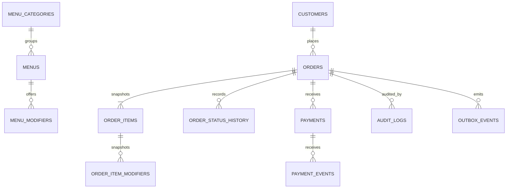

# Core Domain Model

Issue #14 establishes the PostgreSQL 16 schema used by Phase 1A. PostgreSQL stores UUIDs generated by trusted application code, `bigint` Rupiah amounts, and `timestamptz` UTC instants. Order and payment lifecycles remain independent.



## Invariants

- `orders.source`: `WHATSAPP`, `CASHIER_MANUAL`, or `CUSTOMER_WEB`; fulfillment is `PICKUP` for MVP.
- Order and payment statuses exactly follow PD-008. Go constants in `internal/domain` mirror database checks.
- Money uses non-negative integer Rupiah. Item names, SKU, unit price, modifiers, customer identity, and totals are snapshots so later menu/customer edits do not rewrite history.
- `(source, idempotency_key)` uniquely identifies order retries. Non-null `(source, channel_reference)` values are unique while multiple manual orders may omit the reference; provider event IDs and outbox deduplication keys are independently unique.
- Optimistic `version` begins at 1. Status history permits one entry per order version and protected history rows use `ON DELETE RESTRICT`.
- Queue ordering uses `(status, created_at, id)`; customer history and cursor pagination include immutable `id` as tie-breaker.
- Webhook/audit JSON columns accept only objects and must contain redacted metadata. Raw secret/session/customer payloads are forbidden.
- Order creation must atomically insert header, item snapshots, initial status history, audit row, and outbox event; this is enforced by the future repository transaction, not a database trigger.

## Migration

`000002_create_core_domain` is additive and does not modify `000001`. The down migration drops only tables created by `000002` in reverse dependency order. Run the isolated PostgreSQL 16 up/down/up contract with:

```bash
cd pesenhub_be
./scripts/test-migrations.sh
```
