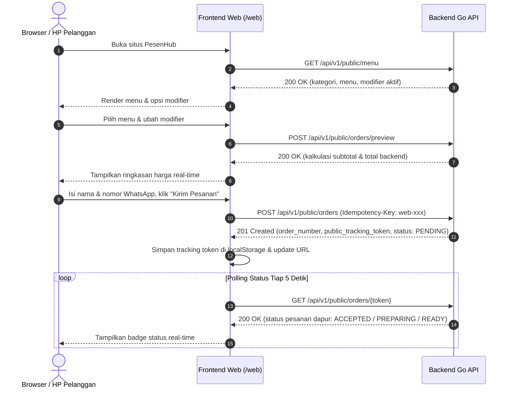

# Customer Web Ordering & Identity Validation Specification

PesenHub menyediakan antarmuka web mobile-first bagi pelanggan untuk melakukan pemesanan langsung (`CUSTOMER_WEB`) tanpa perlu registrasi akun atau download aplikasi.

---

## 1. Prinsip Desain & Privasi (Invariant 11)

- **Tanpa Akun (Guest Checkout)**: Pelanggan cukup memasukkan nama lengkap dan nomor WhatsApp/HP aktif.
- **Invariant 11 & Anti-Enumerasi**: Sistem **tidak pernah** mengizinkan pencarian atau pembukaan riwayat pesanan hanya berdasarkan nama atau nomor handphone tanpa otorisasi tambahan.
- **Opaque Public Tracking Token**: Setelah order dibuat, sistem mengembalikan token acak yang aman berawalan `trk_` (contoh: `trk_a1b2c3d4e5...`). Status pesanan hanya dapat dilacak melalui token unik ini (`GET /api/v1/public/orders/{token}`). Token ini tidak memuat dan tidak mengekspos nomor handphone pelanggan.
- **Backend Single Source of Truth**: Harga satuan, modifier, dan total akhir selalu dihitung dan divalidasi oleh backend (Go), bukan oleh browser/klien.

---

## 2. Validasi Identitas Pelanggan

Format input divalidasi di sisi klien (real-time UX) dan ditegakkan secara ketat di sisi backend:

| Field | Tipe | Aturan Validasi | Contoh Valid | Respon Error (422) |
|---|---|---|---|---|
| `customer_name` | String | Wajib diisi, non-whitespace, maksimal 120 karakter | "Budi Santoso" | `VALIDATION_FAILED` (field: `customer_name`, reason: `Nama pelanggan wajib diisi`) |
| `customer_phone` | String | Wajib diisi, nomor telepon Indonesia (diawali `+628`, `08`, atau `628`), panjang 10–15 digit | `081234567890` (dinormalisasi ke `+6281234567890`) | `VALIDATION_FAILED` (field: `customer_phone`, reason: `Panjang nomor handphone harus antara 10 sampai 15 digit`) |
| `items` | Array | Minimal 1 item, maksimal 100 item. Quantity tiap item 1–99. Menu & modifier harus aktif/tersedia. | `[{"menu_id": "...", "quantity": 1}]` | `VALIDATION_FAILED` (field: `items`) / `CATALOG_UNAVAILABLE` (409) |

---

## 3. Proteksi Double-Submit & Rate Limiting

- **Idempotency Key**: Setiap sesi pengiriman pesanan menggunakan `Idempotency-Key` (UUIDv4). Jika pelanggan secara tidak sengaja menekan tombol kirim lebih dari satu kali atau terjadi pengulangan jaringan (network retry), backend mengembalikan data order yang sama (`200 OK`) tanpa membuat order ganda di database. Jika payload diubah dengan key yang sama, backend menolak dengan `409 IDEMPOTENCY_CONFLICT`.
- **UI Double-Submit Guard**: Tombol submit segera dinonaktifkan (`disabled = true`) dan menampilkan indikator loading saat proses submit berlangsung.
- **Rate Limiting**: Endpoint publik dilindungi oleh rate limiter berbasis IP (sliding window 60 req/menit) untuk mencegah spamming dan automated abuse.

---

## 4. Alur Interaksi API



---

## 5. Spesifikasi Kontrak Endpoint Publik

### A. Preview Pesanan: `POST /api/v1/public/orders/preview`
- **Request Body**:
  ```json
  {
    "items": [
      {
        "menu_id": "b2000000-0000-4000-8000-000000000001",
        "quantity": 2,
        "modifier_groups": [
          {
            "group_id": "b3000000-0000-4000-8000-000000000001",
            "option_ids": ["b4000000-0000-4000-8000-000000000001"]
          }
        ]
      }
    ]
  }
  ```
- **Response `200 OK`**:
  ```json
  {
    "data": {
      "subtotal_amount": 44000,
      "total_amount": 44000,
      "items": [
        {
          "menu_id": "b2000000-0000-4000-8000-000000000001",
          "name": "Nasi Goreng Web",
          "quantity": 2,
          "unit_price_amount": 22000,
          "line_total_amount": 44000,
          "modifiers": [
            {
              "id": "b4000000-0000-4000-8000-000000000001",
              "name": "Extra Pedas",
              "price_delta_amount": 2000
            }
          ]
        }
      ]
    }
  }
  ```

### B. Kirim Pesanan: `POST /api/v1/public/orders`
- **Headers**:
  - `Content-Type: application/json`
  - `Idempotency-Key: web-<uuid>`
- **Request Body**:
  ```json
  {
    "customer_name": "Citra Dewi",
    "customer_phone": "081234567890",
    "notes": "Minta sendok 2",
    "items": [
      {
        "menu_id": "b2000000-0000-4000-8000-000000000001",
        "quantity": 2,
        "modifier_groups": [...]
      }
    ]
  }
  ```
- **Response `201 Created`**:
  ```json
  {
    "data": {
      "order_number": "ORD-05F2157B9EAB4E21",
      "public_tracking_token": "trk_78f14a6011c7429188e6a12b98",
      "status": "PENDING",
      "total_amount": 44000,
      "created_at": "2026-09-03T15:00:00Z"
    }
  }
  ```

### C. Lacak Status Pesanan: `GET /api/v1/public/orders/{token}`
- **Response `200 OK`**:
  ```json
  {
    "data": {
      "order_number": "ORD-05F2157B9EAB4E21",
      "status": "PREPARING",
      "customer_name": "Citra Dewi",
      "total_amount": 44000,
      "created_at": "2026-09-03T15:00:00Z",
      "updated_at": "2026-09-03T15:02:15Z",
      "items": [...]
    }
  }
  ```
  *(Catatan: `customer_phone` tidak disertakan dalam respon demi menjaga privasi data).*
