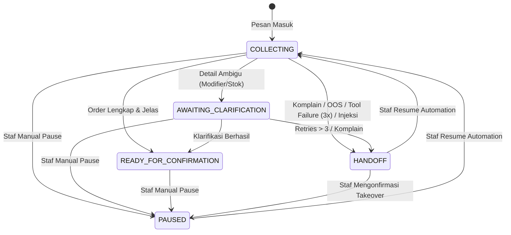

# Hermes Agent-to-Human Handoff & Pause Automation

Dokumen ini menjelaskan arsitektur pengalihan percakapan dari AI Agent (Hermes) ke staf manusia (*human handoff*), pengendalian jeda otomatis (*pause automation*), antrean staf (*handoff queue*), dan pencatatan audit (*audit trail*).

---

## 1. Latar Belakang & Prinsip Utama

1. **Zero Auto-Reply saat Takeover / Handoff**:
   Ketika percakapan dialihkan ke staf manusia (`status = 'HANDOFF'`, `status = 'PAUSED'`, atau `is_paused = true`), sistem AI tidak boleh lagi mengirimkan balasan otomatis apapun kepada pelanggan (`HandledByAgent = false`, `ReplyText = ""`). Hal ini mencegah kebingungan pelanggan dan perebutan konteks (*race condition*) antara staf dan bot.
2. **Kebijakan Resume ("Tidak Mengirim Ulang Pesan Lama")**:
   Saat staf mengaktifkan kembali bot (`RESUME`), state percakapan direset ke `COLLECTING` dan `is_paused = false`. Pesan-pesan yang masuk selama masa jeda **tidak akan diproses ulang** atau dibalas ke pelanggan. Bot hanya memproses pesan baru yang masuk setelah momen resume.
3. **Repeated Tool Failure Threshold**:
   Ambang batas deterministik kegagalan internal tool (seperti kegagalan resolusi katalog atau error inferensi LLM) adalah `MaxToolFailures = 3`. Jika tercapai berturut-turut, sistem otomatis mengalihkan sesi ke staf manusia (`HANDOFF`) dengan alasan `repeated_tool_failure` dan prioritas `HIGH`.
4. **Actor-Audited State Transitions**:
   Setiap aksi `HANDOFF_TRIGGERED`, `PAUSED`, `RESUMED`, `ASSIGNED`, dan `RESOLVED` dicatat ke dalam tabel audit PostgreSQL `agent_conversation_audits` lengkap dengan aktor, alasan, korelasi, dan metadata.

---

## 2. Kategori Trigger Handoff

| Trigger | Deteksi / Kondisi | Handoff Reason | Prioritas | Respon Awal ke Pelanggan |
| --- | --- | --- | --- | --- |
| **Customer Complaint** | Keyword keluhan pelanggan ("komplain", "kecewa", "salah pesanan", "pelayanan buruk", "lama banget", dll.) | `customer_complaint` | `URGENT` | "Mohon maaf atas ketidaknyamanannya kak. Percakapan ini kami alihkan ke staf kami untuk segera menindaklanjuti keluhan kakak." |
| **Human Staff Request** | Permintaan eksplisit bicara dengan staf/orang ("bicara sama manusia", "panggil admin", "minta cs", dll.) | `customer_requested_human` | `HIGH` | "Baik kak, pesanan ini kami jeda dan segera kami hubungkan dengan staf kami untuk membantu langsung." |
| **Repeated Tool Failure** | Error internal tool (LLM timeout/error, catalog failure) mencapai `MaxToolFailures = 3` berturut-turut | `repeated_tool_failure` | `HIGH` | "Mohon maaf kak, sistem kami sedang mengalami gangguan teknis saat memproses pesanan. Percakapan ini kami alihkan ke staf kami." |
| **Prompt Injection** | Terdeteksi upaya jailbreak, override system prompt, atau manipulasi boundary tag | `prompt_injection_detected` | `HIGH` | "Mohon maaf kak, permintaan tersebut tidak dapat kami proses. Percakapan ini kami alihkan ke staf kami." |
| **Max Clarification Retries** | Klarifikasi ambigu gagal/tidak valid mencapai batas `MaxClarificationAttempts = 3` berturut-turut | `max_clarification_attempts_exceeded` | `NORMAL` | "Mohon maaf kak, pesanan ini kami alihkan ke staf kami untuk membantu mencatat detail pesanan kakak secara manual." |
| **Out of Scope** | Topik di luar pemesanan makanan/minuman resto (pinjaman uang, lowongan kerja, servis motor, politik) | `out_of_scope_inquiry` | `LOW` | "Mohon maaf kak, sistem otomatis kami hanya melayani pemesanan menu makanan dan minuman. Percakapan ini kami teruskan ke staf kami jika ada keperluan lain." |
| **Manual Staff Pause** | Staf menekan tombol jeda/takeover via API / dashboard | `manual_pause` | Sesuai input staf | Tidak ada balasan otomatis (staf langsung mengambil alih) |

---

## 3. Diagram Alur Transisi State



---

## 4. API Kontrak Staf (Backend)

Seluruh endpoint memerlukan kredensial staf (`STAFF` atau `ADMIN`) melalui context principal atau header `X-Staff-ID` dan `X-Staff-Role`.

### 4.1. List Handoff Queue
- **Endpoint**: `GET /api/v1/agent/handoffs`
- **Query Params**:
  - `status`: `PENDING` (default), `ASSIGNED`, atau `ALL`
  - `priority`: `URGENT`, `HIGH`, `NORMAL`, `LOW`
  - `limit`: integer (default 50, max 100)
  - `offset`: integer (default 0)
- **Response**:
```json
{
  "data": [
    {
      "id": "uuid",
      "session": "default",
      "customer_phone": "+6281234567890",
      "status": "HANDOFF",
      "is_paused": true,
      "handoff_status": "PENDING",
      "handoff_reason": "customer_complaint",
      "handoff_priority": "URGENT",
      "assigned_to": null,
      "clarification_attempts": 0,
      "last_question": "Mohon maaf atas ketidaknyamanannya...",
      "last_inbound_message_id": "uuid",
      "current_draft": {},
      "created_at": "2026-09-04T08:00:00Z",
      "updated_at": "2026-09-04T08:01:00Z"
    }
  ],
  "meta": {
    "total": 1,
    "limit": 50,
    "offset": 0
  }
}
```

### 4.2. Manual Pause
- **Endpoint**: `POST /api/v1/agent/conversations/pause`
- **Body**:
```json
{
  "session": "default",
  "customer_phone": "+6281234567890",
  "reason": "Mengambil alih chat untuk komplain pesanan dingin"
}
```

### 4.3. Manual Resume
- **Endpoint**: `POST /api/v1/agent/conversations/resume`
- **Body**:
```json
{
  "session": "default",
  "customer_phone": "+6281234567890",
  "reason": "Masalah komplain telah selesai diselesaikan staf"
}
```

### 4.4. Assign Staff
- **Endpoint**: `POST /api/v1/agent/conversations/assign`
- **Body**:
```json
{
  "session": "default",
  "customer_phone": "+6281234567890",
  "assigned_to": "staff_kasir_1"
}
```

### 4.5. Resolve Handoff
- **Endpoint**: `POST /api/v1/agent/conversations/resolve`
- **Body**:
```json
{
  "session": "default",
  "customer_phone": "+6281234567890",
  "resolution": "Pelanggan memilih ganti menu Nasi Goreng Spesial Pedas",
  "resume_automation": true
}
```

### 4.6. Riwayat Audit Percakapan
- **Endpoint**: `GET /api/v1/agent/conversations/{id}/audit-logs`
- **Response**:
```json
{
  "data": [
    {
      "id": "uuid",
      "conversation_id": "uuid",
      "session": "default",
      "customer_phone": "+6281234567890",
      "action": "PAUSED",
      "actor": "staff_kasir_1",
      "actor_role": "STAFF",
      "reason": "Mengambil alih chat untuk komplain pesanan dingin",
      "metadata": { "status": "PAUSED" },
      "correlation_id": "req-123",
      "created_at": "2026-09-04T08:05:00Z"
    }
  ]
}
```
