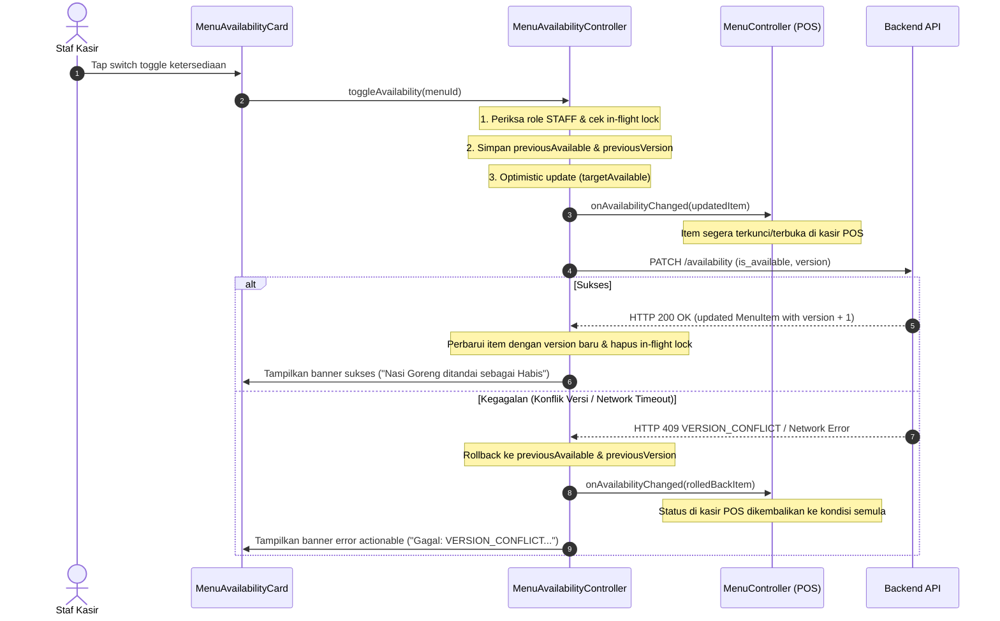

# Pengelolaan Menu Availability pada Flutter (#31)

Dokumentasi arsitektur, kontrol otorisasi (*role guard*), alur pembaruan optimistik dengan rollback otomatis, serta sinkronisasi ketersediaan item menu pada aplikasi kasir POS dan KDS PesenHub.

---

## 1. Latar Belakang dan Tujuan

Dalam operasional harian outlet (seperti warung nasi goreng atau gerai F&B cepat saji), bahan baku tertentu (misal: telur, cumi, atau varian bumbu) dapat habis sewaktu-waktu di tengah jam sibuk. Staf kasir dan dapur memerlukan kemampuan untuk:
1. Mengubah status ketersediaan item menu (*Tersedia* vs *Habis*) dalam hitungan detik.
2. Memperoleh umpan balik langsung tanpa jeda (*optimistic UI*).
3. Menjamin bahwa jika terjadi kegagalan jaringan atau konflik versi (*concurrent update conflict*), status UI dikembalikan (*rollback*) ke kondisi server aktual secara aman.
4. Mencegah kru tanpa hak akses (misal role `KDS` atau `CUSTOMER`) mengubah ketersediaan menu.
5. Memastikan item yang ditandai *Habis* seketika terkunci dan tidak dapat dipilih pelanggan atau dimasukkan ke keranjang kasir POS baru.

---

## 2. Arsitektur Komponen

```
pesenhub_app/lib/menu/
├── controllers/
│   ├── menu_availability_controller.dart  # State ketersediaan, role guard, rollback, versioning
│   ├── menu_controller.dart               # Katalog menu POS & search debounce
│   └── modifier_selection_state.dart      # Konfigurasi modifier & batas backend
├── widgets/
│   ├── menu_availability_card.dart        # Kartu item menu dengan toggle switch & version chip
│   ├── menu_category_filter.dart          # Filter chip kategori horizontal
│   ├── menu_item_card.dart                # Kartu item katalog POS (dengan visual 'Habis')
│   └── modifier_config_dialog.dart        # Dialog konfigurasi modifier
├── menu_availability_view.dart            # Layar operasional pengelolaan ketersediaan
└── menu_catalog_view.dart                 # Layar katalog pemesanan POS
```

---

## 3. Role Guard (Otorisasi Staf)

Fitur mutasi ketersediaan menu diproteksi oleh *Role Guard* di tingkat aplikasi (selaras dengan proteksi backend pada `PATCH /api/v1/admin/menus/{id}/availability`):
- **Role `STAFF`**: Diberikan hak akses penuh (*write access*). Switch interaktif aktif dengan target sentuh minimal 48px.
- **Role Non-`STAFF` (`KDS`, `CUSTOMER`, `VIEWER`)**:
  - Tampilan beralih ke *Mode Pantau* (*read-only*).
  - Switch ketersediaan dinonaktifkan (`onChanged: null`).
  - Menampilkan label teks pembatasan: *"Hanya staf kasir yang dapat mengubah ketersediaan"*.
  - Jika metode `toggleAvailability` dipanggil secara terprogram, aksi segera ditolak dan menghasilkan pesan banner error actionable: *"Akses ditolak: Hanya staf berwenang yang dapat mengubah ketersediaan menu."*

---

## 4. Siklus Optimistic Update dan Rollback

Alur perubahan status ketersediaan menu dirancang dengan *resilience* tinggi:



---

## 5. Sinkronisasi dengan Kasir POS

Ketika item menu diubah statusnya menjadi `Habis`:
1. `MenuItemCard` pada katalog kasir POS segera menampilkan badge merah `Habis`.
2. Tombol `+ Tambah` / `+ Kustom` pada kartu menjadi tidak aktif (`onPressed: null`).
3. Tap pada kartu tidak membuka dialog konfigurasi modifier.
4. Item tidak dapat dimasukkan ke keranjang belanja kasir (`CartController`).
5. Jika item kembali diubah menjadi `Tersedia`, tombol seketika aktif kembali.

---

## 6. Tata Letak Adaptif Mobile dan Tablet

Antarmuka `MenuAvailabilityView` mendukung berbagai ukuran layar:
- **Mobile (< 600dp)**:
  - Tata letak kolom tunggal vertikal scrollable tanpa horizontal overflow.
  - Search bar teks dengan tombol clear instan.
  - Status filter chips: `Semua (N)`, `Tersedia (N)`, `Habis (N)`.
  - Filter kategori horizontal.
- **Tablet (>= 600dp)**:
  - Grid responsif 2 kolom dengan spasi dan visual card yang lapang.
  - Target sentuh ergonomis (>= 48px) untuk kemudahan operasional di meja kasir.
- **Presentation States**:
  - *Loading*: `AppLoadingState` dengan pesan *"Memuat data ketersediaan menu..."*.
  - *Empty*: `AppEmptyState` dengan pesan pencarian/filter kosong.
  - *Error*: `AppErrorState` dengan tombol *"Coba Lagi"*.

---

## 7. Bukti Validasi dan Pengujian

Pengujian dilakukan melalui unit test, widget test, dan static analysis:
- `flutter test test/menu_availability_test.dart`:
  - `Criteria #1`: Successful toggle updates version and notifies listeners/sync (PASS).
  - `Criteria #2`: Mutation failure triggers rollback to server state and actionable feedback (PASS).
  - `Criteria #3`: Unauthorized roles (KDS, CUSTOMER) cannot mutate availability (PASS).
  - `Criteria #3 UI`: MenuAvailabilityCard disables toggle switch when not staff (PASS).
  - `Criteria #4`: Setting item unavailable immediately prevents it from being ordered in POS (PASS).
  - `Criteria #5`: Responsive layout on mobile and tablet with loading, empty, error, and filter states (PASS).
- Full Flutter test suite: **78/78 tests passed** (100%).
- `flutter analyze`: **No issues found** (0 warnings, 0 errors).
- `dart format`: **0 changes needed** (100% compliant).
- Backend suite: `cd pesenhub_be && ./run.sh check` (**PASS**).
