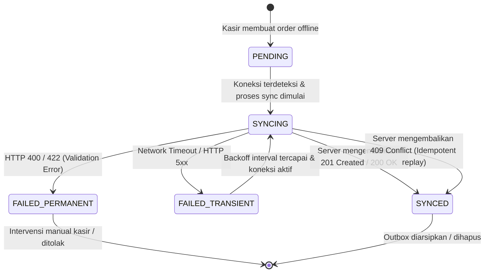

# Arsitektur Offline Outbox dan Background Synchronization (#33)

Dokumentasi arsitektur penyimpanan mutasi lokal (*durable outbox pattern*), siklus hidup sinkronisasi latar belakang (*background synchronization*), strategi *exponential backoff*, serta pencegahan duplikasi (*idempotency & local-to-server ID mapping*) pada aplikasi kasir POS dan KDS Flutter PesenHub.

---

## 1. Latar Belakang dan Masalah

Pada operasional harian warung F&B / gerai cepat saji:
1. **Konektivitas Tidak Stabil**: Jaringan Wi-Fi atau seluler kasir dapat putus sewaktu-waktu di jam sibuk.
2. **Kelancaran Kasir**: Kasir harus tetap dapat membuat order tunai/manual (*CASHIER_MANUAL*) secara cepat tanpa jeda (*zero blocking latency*) meskipun perangkat sedang offline.
3. **Pencegahan Duplikasi**: Saat koneksi pulih, setiap mutasi yang diantrikan tidak boleh membuat order ganda di server backend.
4. **Resiliensi Kegagalan**:
   - Gangguan jaringan sementara (*transient network glitch* / HTTP 5xx) harus di-retry secara berurutan dengan *exponential backoff* agar tidak membanjiri server (*retry storm*).
   - Kesalahan validasi permanen (HTTP 400 Bad Request / 422 Unprocessable Entity) harus dihentikan dari antrean retry dan dilaporkan secara *actionable* kepada kasir.
5. **Ketahanan Restart**: Jika aplikasi ditutup paksa atau perangkat mati (*crash / restart*), seluruh antrean outbox yang belum tersinkronisasi harus tetap utuh di SQLite (*durable storage*).

---

## 2. State Machine Outbox Mutation

Setiap mutasi offline dikelola oleh status deterministik:



### Definisi Status:
- `PENDING`: Mutasi tersimpan lokal di SQLite dan menunggu giliran sinkronisasi.
- `SYNCING`: Mutasi sedang dikirimkan ke backend melalui REST API.
- `SYNCED`: Mutasi berhasil diakui (*acknowledged*) oleh server backend dengan `server_order_id` yang valid.
- `FAILED_TRANSIENT`: Kegagalan sementara (koneksi putus / server 503). Dijadwalkan untuk retry otomatis menggunakan waktu `next_retry_at`.
- `FAILED_PERMANENT`: Kesalahan validasi atau payload tidak valid. Retry otomatis dihentikan agar tidak terjadi perulangan sia-sia.

---

## 3. Skema Database SQLite Outbox (v3)

Tabel `outbox_mutations` ditambahkan pada migrasi database lokal versi 3:

```sql
CREATE TABLE IF NOT EXISTS outbox_mutations (
  id TEXT PRIMARY KEY,
  idempotency_key TEXT NOT NULL UNIQUE,
  client_order_id TEXT NOT NULL UNIQUE,
  mutation_type TEXT NOT NULL,
  payload_json TEXT NOT NULL,
  sync_status TEXT NOT NULL,
  retry_count INTEGER NOT NULL DEFAULT 0,
  last_attempted_at TEXT,
  next_retry_at TEXT,
  server_order_id TEXT,
  error_message TEXT,
  created_at TEXT NOT NULL
);

CREATE INDEX IF NOT EXISTS idx_outbox_status_retry 
ON outbox_mutations (sync_status, next_retry_at);

CREATE INDEX IF NOT EXISTS idx_outbox_client_order_id 
ON outbox_mutations (client_order_id);
```

---

## 4. Siklus Exponential Backoff

Untuk mencegah *thundering herd* dan *retry storm* saat backend pulih:
$$\text{Delay} = \min(\text{baseDelay} \times 2^{\text{retryCount}}, \text{maxDelay})$$

- $\text{baseDelay} = 1\text{ detik}$
- $\text{maxDelay} = 60\text{ detik}$
- Contoh interval:
  - Retry #1: $1 \times 2^0 = 1\text{s}$
  - Retry #2: $1 \times 2^1 = 2\text{s}$
  - Retry #3: $1 \times 2^2 = 4\text{s}$
  - Retry #4: $1 \times 2^3 = 8\text{s}$
  - Retry #5: $1 \times 2^4 = 16\text{s}$
  - Retry #6+: Dibatasi maksimal 60 detik.

---

## 5. Kontrak Idempotensi dan Pemetaan ID (Local-to-Server)

Sesuai **Invariant #8**:
1. Setiap pesanan kasir dibuat dengan `clientOrderId` dan `idempotencyKey` yang unik secara kriptografis (32 karakter hex).
2. Pesanan disimpan di tabel lokal `queue_orders` dengan ID lokal (misal `client_order_id`).
3. Saat disinkronkan ke `POST /api/v1/orders`:
   - Header `Idempotency-Key` dikirimkan bersama payload.
   - Jika response `201 Created`: Server mengembalikan `server_order_id` (misal `ord-srv-12345`). Outbox menyimpan pemetaan `server_order_id`, dan entitas pesanan lokal diperbarui.
   - Jika response `409 Conflict` (atau idempotent replay): Server mengembalikan order yang sudah pernah tercatat. Outbox mendeteksi order yang ada dan menganggap mutasi berhasil disinkronkan (`SYNCED`) tanpa menduplikasi kartu pesanan di antrean kasir.

---

## 6. Umpan Balik Antarmuka Pengguna (UI Feedback)

Widget `SyncStatusBadge` disematkan pada header/toolbar POS dan KDS:
- **Idle / Terhubung & Sinkron**: Badge ikon awan hijau atau tersembunyi saat antrean bersih.
- **Sedang Sinkronisasi**: Spinner berputar dengan teks *"Menyinkronkan N pesanan..."*.
- **Offline / Menunggu Jaringan**: Badge peringatan amber mencolok *"N pesanan offline antre"*.
- **Permanent Error**: Badge peringatan merah dengan dialog rincian kesalahan agar kasir dapat memeriksa order yang tertolak.
- **Responsif**: Bekerja mulus pada layout mobile (< 600dp) dan tablet (>= 600dp) tanpa *RenderFlex overflow*.
