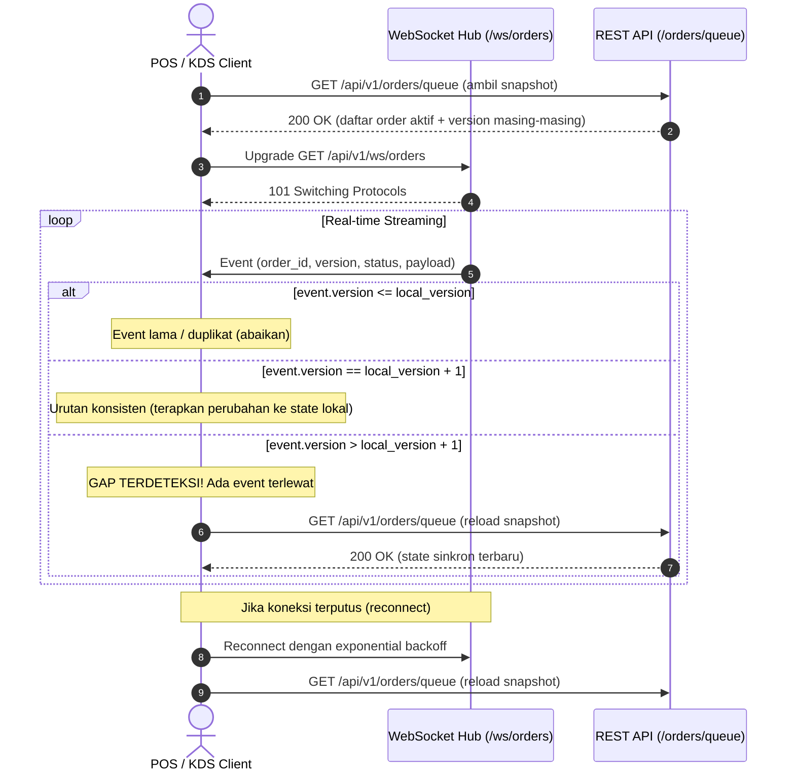

# WebSocket Order Events, Heartbeat, and Recovery Specification

PesenHub mendistribusikan pembaruan status order secara real-time ke aplikasi POS Kasir dan Kitchen Display System (KDS) menggunakan WebSocket di jalur `GET /api/v1/ws/orders` yang dipadukan dengan REST snapshot recovery (`GET /api/v1/orders/queue`).

---

## 1. Handshake & Autentikasi

- **Endpoint**: `GET /api/v1/ws/orders`
- **Protokol**: RFC 6455 WebSocket Upgrade
- **Autentikasi**:
  - Header: `Authorization: Bearer <token>`
  - Query Parameter: `?token=<token>` (didukung untuk lingkungan web di mana browser API tidak mengizinkan kustom header saat handshake HTTP awal).
  - Token dicocokkan secara utuh terhadap `APP_STAFF_TOKEN` / `APP_KDS_TOKEN`; prefix atau nilai yang tidak dikenal ditolak. URL handshake yang memuat token tidak boleh dicatat.
- **Otorisasi**:
  - Hanya role `STAFF` dan `KDS` yang diizinkan membuka koneksi.
  - Percobaan koneksi tanpa kredensial atau peran tidak terdaftar ditolak dengan `403 FORBIDDEN` / `401 UNAUTHENTICATED`.

---

## 2. Format Envelope Event

Setiap event dikirim dalam format JSON text frame:

```json
{
  "event_id": "81000000-0000-4000-8000-000000000001",
  "event_type": "ORDER_CREATED",
  "order_id": "f1000000-0000-4000-8000-000000000001",
  "version": 1,
  "source": "CASHIER_MANUAL",
  "status": "PENDING",
  "timestamp": "2026-09-03T15:00:00Z",
  "payload": {
    "order_id": "f1000000-0000-4000-8000-000000000001",
    "order_number": "ORD-20260903-0001",
    "source": "CASHIER_MANUAL",
    "status": "PENDING",
    "total_amount": 35000,
    "version": 1
  }
}
```

### Event Types:
- `ORDER_CREATED`: Terjadi saat order manual, web customer, atau WhatsApp masuk ke sistem.
- `ORDER_STATUS_CHANGED`: Terjadi saat status order berganti (e.g. `PENDING` -> `ACCEPTED` -> `PREPARING` -> `READY_FOR_PICKUP` -> `COMPLETED`).

---

## 3. Redaksi PII Berbasis Peran (RBAC)

- **Role `STAFF`**: Menerima payload lengkap termasuk data kontak pelanggan jika tersedia.
- **Role `KDS`**: Menerima event dengan data privasi pelanggan yang diredaksi (`customer_phone` disetel `null` / dihapus, `customer_id` dihapus). Nama pelanggan tetap disediakan untuk memanggil pelanggan ketika pesanan siap diambil.

---

## 4. Heartbeat (Ping / Pong)

- Server mengirimkan frame `Ping` secara periodik (setiap 15 detik) untuk mendeteksi silent disconnect / network timeout.
- Client merespons dengan frame `Pong`.
- Client juga dapat mengirimkan frame `Ping` kapan saja dan server akan otomatis merespons dengan `Pong`.
- Jika frame gagal terkirim karena buffer penuh atau koneksi terputus, server secara otomatis membersihkan koneksi dari Hub (backpressure protection).

---

## 5. Alur Pemulihan & Deteksi Gap (Snapshot Recovery)

Untuk mencegah race condition antara koneksi WebSocket dan antrean saat ini, client menerapkan alur deterministik:



### Aturan Logika Client:
1. Simpan `last_version` untuk setiap `order_id` dari snapshot awal.
2. Jika menerima event dengan `version <= last_version`: abaikan (mencegah duplicate processing).
3. Jika menerima event dengan `version == last_version + 1`: update state lokal dan set `last_version = version`.
4. Jika menerima event dengan `version > last_version + 1`: menandakan terjadi paket hilang (network packet loss atau disconnection sementara). Segera panggil `GET /api/v1/orders/queue` untuk merefresh seluruh snapshot antrean.
